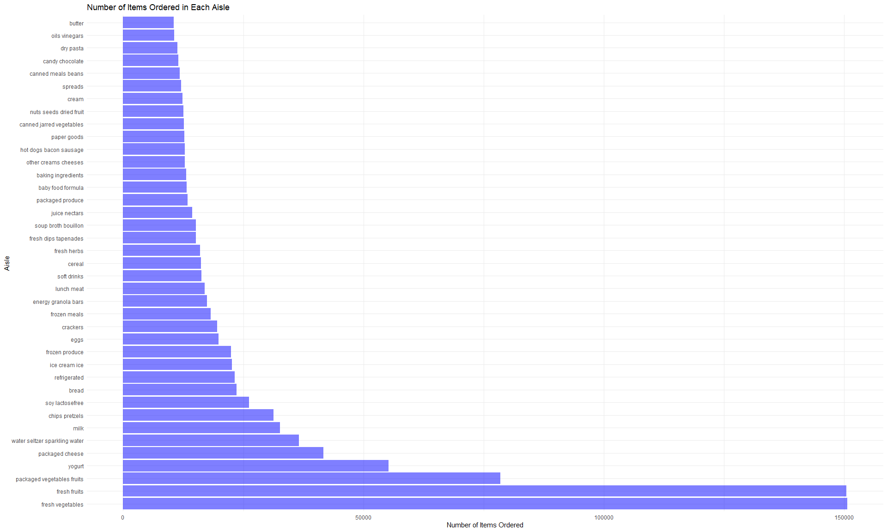
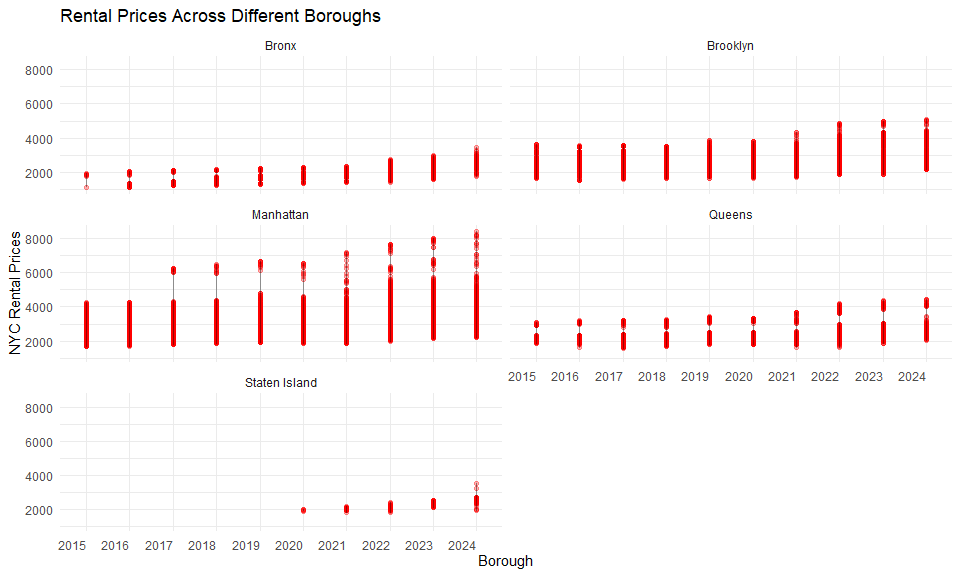
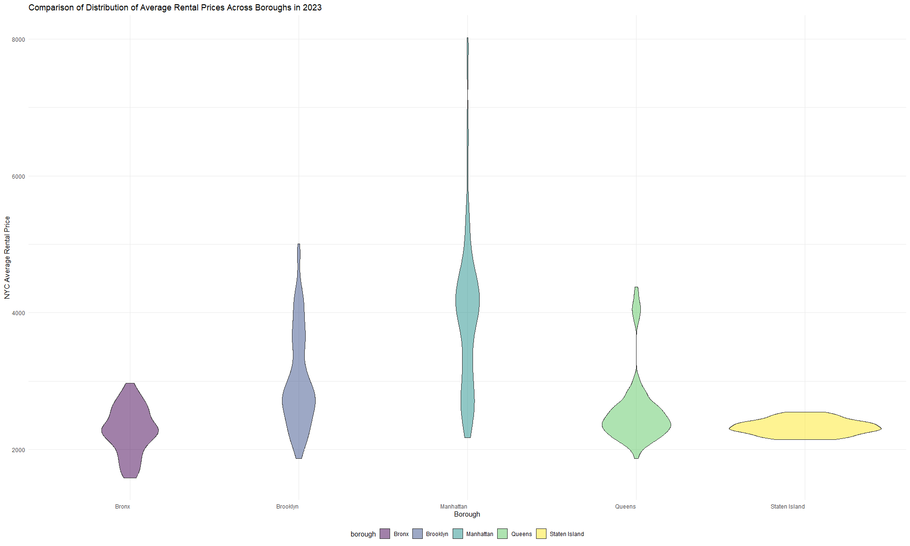
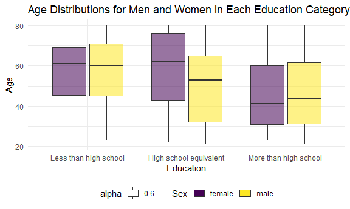
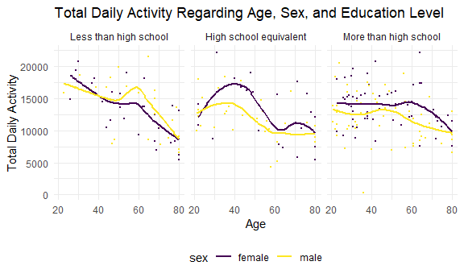
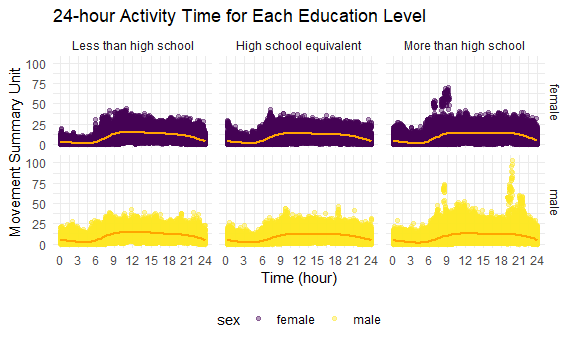

p8105_hw3_yh3964
================
Yirou Hu
2025-10-08

Load packages and datasets

``` r
library(patchwork)
library(tidyverse)
```

    ## ── Attaching core tidyverse packages ──────────────────────── tidyverse 2.0.0 ──
    ## ✔ dplyr     1.1.4     ✔ readr     2.1.5
    ## ✔ forcats   1.0.0     ✔ stringr   1.5.1
    ## ✔ ggplot2   3.5.2     ✔ tibble    3.3.0
    ## ✔ lubridate 1.9.4     ✔ tidyr     1.3.1
    ## ✔ purrr     1.1.0     
    ## ── Conflicts ────────────────────────────────────────── tidyverse_conflicts() ──
    ## ✖ dplyr::filter() masks stats::filter()
    ## ✖ dplyr::lag()    masks stats::lag()
    ## ℹ Use the conflicted package (<http://conflicted.r-lib.org/>) to force all conflicts to become errors

``` r
library(dplyr)
library(p8105.datasets)
data("instacart") 
```

Set the size of plots

``` r
knitr::opts_chunk$set(
  fig.width = 6,
  fig.asp = 0.6,
  out.width = "90%"
)
```

Change legend position to bottom and remove the frame

``` r
theme_set(theme_minimal() + theme(legend.position = "bottom")) 
```

We change continuous and discrete variables with “viridis” for color and
fill

``` r
options(
  ggplot2.continuous.colour = "viridis",
  ggplot2.continuous.fill = "viridis"
)

scale_colour_discrete = scale_colour_viridis_d
scale_fill_discrete = scale_fill_viridis_d
```

# Problem 1

The goal is to do some exploration of this dataset. To that end, write a
short description of the dataset, noting the size and structure of the
data, describing some key variables, and giving illstrative examples of
observations. Then, do or answer the following (commenting on the
results of each)

## How many aisles are there, and which aisles are the most items ordered from?

``` r
aisles_number_df = 
  instacart |>
  group_by(aisle) |>
  summarize(count_aisle = n()) |>
  mutate(aisle_rank = rank(desc(count_aisle))) |>
  arrange(aisle_rank)
```

Dataset description:

The whole dataset provides detailed information on each product that
customers ordered, including the product name, department, and aisle, as
well as the information about the time they make this order, such as
order_dow and order_hour_of_day. Additionally, it includes informaiton
about whether the product was reordered, the order number, and the
number of days since the prior order. The product id, aisle id and the
order they belonged to are also provided.

There are 134 aisles and fresh vegetables is the aisle with the most
items ordered from.

## Make a plot that shows the number of items ordered in each aisle, limiting this to aisles with more than 10000 items ordered. Arrange aisles sensibly, and organize your plot so others can read it.

``` r
instacart |>
  group_by(aisle) |>
  summarize(count_aisle = n()) |>
  arrange(count_aisle) |>
  filter(count_aisle > 10000) |>
  ggplot(aes(x = count_aisle, y = reorder(aisle, -count_aisle))) +
  geom_bar(stat = "identity", fill = "blue", alpha = 0.5) +
  labs(                                             
    title = "Number of Items Ordered in Each Aisle",
    x = "Number of Items Ordered",
    y = "Aisle"
  ) 
```



Plot description:

This bar chart shows the number of items ordered from each aisle. It’s
clear that “fresh vegetables” and “fresh fruits” are the most popular,
with the highest order counts. Other top sellers include “packaged
vegetables and fruits,” “yogurt,” and “packaged cheese.” Less ordered
items come from aisles like “butter” and “oils vinegars,” yet they still
exceed 10,000 orders. This chart helps identify which products are in
highest demand.

## Make a table showing the three most popular items in each of the aisles “baking ingredients”, “dog food care”, and “packaged vegetables fruits”. Include the number of times each item is ordered in your table.

``` r
popular_items_df = 
  instacart |>
  filter(aisle %in% c("baking ingredients", "dog food care", "packaged vegetables fruits")) |>
  group_by(aisle, product_name) |>
  summarise(number_of_time = n()) |>
  mutate(rank_of_time = rank(desc(number_of_time))) |>
  arrange(rank_of_time) |>
  filter(rank_of_time == c(1,2,3)) |>
  arrange(desc(number_of_time)) 
```

    ## `summarise()` has grouped output by 'aisle'. You can override using the
    ## `.groups` argument.

    ## Warning: There were 3 warnings in `filter()`.
    ## The first warning was:
    ## ℹ In argument: `rank_of_time == c(1, 2, 3)`.
    ## ℹ In group 1: `aisle = "baking ingredients"`.
    ## Caused by warning in `rank_of_time == c(1, 2, 3)`:
    ## ! longer object length is not a multiple of shorter object length
    ## ℹ Run `dplyr::last_dplyr_warnings()` to see the 2 remaining warnings.

``` r
popular_items_df |>
  knitr::kable(col.names = c("Aisle", "Product Name", "Number of times ordered", "Rank"))
```

| Aisle | Product Name | Number of times ordered | Rank |
|:---|:---|---:|---:|
| packaged vegetables fruits | Organic Baby Spinach | 9784 | 1 |
| packaged vegetables fruits | Organic Raspberries | 5546 | 2 |
| packaged vegetables fruits | Organic Blueberries | 4966 | 3 |
| baking ingredients | Light Brown Sugar | 499 | 1 |
| baking ingredients | Pure Baking Soda | 387 | 2 |
| baking ingredients | Cane Sugar | 336 | 3 |
| dog food care | Snack Sticks Chicken & Rice Recipe Dog Treats | 30 | 1 |
| dog food care | Organix Chicken & Brown Rice Recipe | 28 | 2 |
| dog food care | Small Dog Biscuits | 26 | 3 |

## Make a table showing the mean hour of the day at which Pink Lady Apples and Coffee Ice Cream are ordered on each day of the week; format this table for human readers (i.e. produce a 2 x 7 table).

``` r
instacart |>
  filter(product_name %in% c("Pink Lady Apples", "Coffee Ice Cream")) |>
  group_by(product_name, order_dow) |>
  summarise(mean_order_hour_of_day = mean(order_hour_of_day)) |>
  pivot_wider(
    names_from = order_dow,
    values_from = mean_order_hour_of_day
  ) |>
  knitr::kable() 
```

    ## `summarise()` has grouped output by 'product_name'. You can override using the
    ## `.groups` argument.

| product_name     |        0 |        1 |        2 |        3 |        4 |        5 |        6 |
|:-----------------|---------:|---------:|---------:|---------:|---------:|---------:|---------:|
| Coffee Ice Cream | 13.77419 | 14.31579 | 15.38095 | 15.31818 | 15.21739 | 12.26316 | 13.83333 |
| Pink Lady Apples | 13.44118 | 11.36000 | 11.70213 | 14.25000 | 11.55172 | 12.78431 | 11.93750 |

The table shows the average ordering hours for “Pink Lady Apples” and
“Coffee Ice Cream” by day of the week. “Coffee Ice Cream” orders peak
mid-week, especially on Wednesdays around 15 hours. “Pink Lady Apples”
are most ordered on Thursdays around 14 hours.

# Problem 2

This Problem uses the Zillow datasets introduced in Homework 2.

We first do data cleaning about zip code datasets.

``` r
zip_codes_df = 
  read_csv("zillow_data/Zip Codes.csv") |>
  janitor::clean_names() |> 
  select(-state_fips, -file_date) |> 
  distinct(zip_code, .keep_all = TRUE)
```

    ## Rows: 322 Columns: 7
    ## ── Column specification ────────────────────────────────────────────────────────
    ## Delimiter: ","
    ## chr (4): County, County Code, File Date, Neighborhood
    ## dbl (3): State FIPS, County FIPS, ZipCode
    ## 
    ## ℹ Use `spec()` to retrieve the full column specification for this data.
    ## ℹ Specify the column types or set `show_col_types = FALSE` to quiet this message.

Next, we do data cleaning on zillow rent price dataset.

``` r
zillow_rent_df = 
  read_csv("zillow_data/Zip_zori_uc_sfrcondomfr_sm_month_NYC.csv") |>
  pivot_longer(
    cols = "2015-01-31":"2024-08-31",
    names_to = "Date",
    values_to = "Zori"
  ) |> 
  rename(
     zip_code = "RegionName",
     region_id = "RegionID",
     size_rank = "SizeRank",
     state = "State",
     county_name = "CountyName"
  ) |>
  select(zip_code, -RegionType, -StateName, -City, -Metro, everything()) |>
  drop_na(Zori)
```

    ## Rows: 149 Columns: 125
    ## ── Column specification ────────────────────────────────────────────────────────
    ## Delimiter: ","
    ## chr   (6): RegionType, StateName, State, City, Metro, CountyName
    ## dbl (119): RegionID, SizeRank, RegionName, 2015-01-31, 2015-02-28, 2015-03-3...
    ## 
    ## ℹ Use `spec()` to retrieve the full column specification for this data.
    ## ℹ Specify the column types or set `show_col_types = FALSE` to quiet this message.

We merge them together

``` r
zip_zillow_merge_df =
  left_join(zillow_rent_df, zip_codes_df, by = "zip_code") |>
  separate(Date, into = c("year", "month", "day"), sep = "-") |>
  mutate(
    borough = case_match(
    county_name,
      "Bronx County" ~ "Bronx",
      "Kings County" ~ "Brooklyn",
      "New York County" ~ "Manhattan",
      "Queens County" ~ "Queens",
      "Richmond County" ~ "Staten Island"
    )
  )
```

## There are 116 months between January 2015 and August 2024. How many ZIP codes are observed 116 times? How many are observed fewer than 10 times? Why are some ZIP codes are observed rarely and others observed in each month?

Answer:

- There are 48 ZIP codes observed 116 times.
- There are 26 ZIP codes observed fewer than 10 times.
- The reason for ZIP codes are observed rarely and other are observed in
  each month is due to the data availability and collection ability of
  Zillow.
- Furthermore, some ZIP codes may contain industrial zones, commercial
  areas, parks, or other non-residential regions, where typical rental
  data is unavailable.
- Moreover, there exists missing ZIP codes correspond to areas with
  smaller populations or fewer rental units. Zillow may not have enough
  transactions to generate reliable rental price estimates.

## Create a reader-friendly table showing the average rental price in each borough and year (not month). Comment on trends in this table.

``` r
average_rent_df =
  zip_zillow_merge_df |> 
  group_by(borough, year) |> 
  summarize(
    average_rent_price = mean(Zori, na.rm = TRUE)
  ) 
```

    ## `summarise()` has grouped output by 'borough'. You can override using the
    ## `.groups` argument.

``` r
average_rent_df |>  
  knitr::kable()
```

| borough       | year | average_rent_price |
|:--------------|:-----|-------------------:|
| Bronx         | 2015 |           1759.595 |
| Bronx         | 2016 |           1520.194 |
| Bronx         | 2017 |           1543.599 |
| Bronx         | 2018 |           1639.430 |
| Bronx         | 2019 |           1705.589 |
| Bronx         | 2020 |           1811.443 |
| Bronx         | 2021 |           1857.777 |
| Bronx         | 2022 |           2054.267 |
| Bronx         | 2023 |           2285.459 |
| Bronx         | 2024 |           2496.896 |
| Brooklyn      | 2015 |           2492.928 |
| Brooklyn      | 2016 |           2520.357 |
| Brooklyn      | 2017 |           2545.828 |
| Brooklyn      | 2018 |           2547.291 |
| Brooklyn      | 2019 |           2630.504 |
| Brooklyn      | 2020 |           2555.051 |
| Brooklyn      | 2021 |           2549.890 |
| Brooklyn      | 2022 |           2868.199 |
| Brooklyn      | 2023 |           3015.184 |
| Brooklyn      | 2024 |           3126.803 |
| Manhattan     | 2015 |           3022.042 |
| Manhattan     | 2016 |           3038.818 |
| Manhattan     | 2017 |           3133.848 |
| Manhattan     | 2018 |           3183.703 |
| Manhattan     | 2019 |           3310.408 |
| Manhattan     | 2020 |           3106.517 |
| Manhattan     | 2021 |           3136.632 |
| Manhattan     | 2022 |           3778.375 |
| Manhattan     | 2023 |           3932.610 |
| Manhattan     | 2024 |           4078.440 |
| Queens        | 2015 |           2214.707 |
| Queens        | 2016 |           2271.955 |
| Queens        | 2017 |           2263.303 |
| Queens        | 2018 |           2291.918 |
| Queens        | 2019 |           2387.816 |
| Queens        | 2020 |           2315.632 |
| Queens        | 2021 |           2210.787 |
| Queens        | 2022 |           2406.038 |
| Queens        | 2023 |           2561.615 |
| Queens        | 2024 |           2694.022 |
| Staten Island | 2020 |           1977.608 |
| Staten Island | 2021 |           2045.430 |
| Staten Island | 2022 |           2147.436 |
| Staten Island | 2023 |           2332.934 |
| Staten Island | 2024 |           2536.442 |

Comments on table:

- The table presents the average rental prices for different boroughs of
  New York City from 2015 to 2024. All boroughs have seen an increase in
  average rental prices over the decade. This suggests a general trend
  of rising rents across the city.
- Manhattan: Manhattan has the highest average rental prices throughout
  the period, with a noticeable increase from \$3,022 in 2015 to \$4,078
  in 2024. The largest year-over-year increase appears between 2022 and
  2023.
- Brooklyn: Brooklyn starts with lower rents compared to Manhattan but
  shows a steady increase, reaching \$3,126 by 2024. The most
  significant rise occurs between 2021 and 2022.
- Queens: Queens also exhibits a consistent upward trend, with rents
  rising from \$2,214 in 2015 to \$2,694 in 2024. The increase is more
  gradual compared to Manhattan and Brooklyn.
- Bronx: Starting with the lowest average rents among the boroughs,
  Bronx sees a gradual increase over the years, with a more pronounced
  rise from 2021 onwards, reaching \$2,496 in 2024.
- Staten Island: Data for Staten Island begins in 2020, and it shows a
  steady increase in rental prices from that year through 2024, with the
  average rent rising from \$1,977 to \$2,536.
- In summary, the table indicates a overall increase in rental prices
  across all boroughs over the ten-year span, with Manhattan maintaining
  the highest rents and The Bronx starting with the lowest but showing a
  significant increase in recent years.

## Make a plot showing NYC Rental Prices within ZIP codes for all available years. Your plot should facilitate comparisons across boroughs. Comment on any significant elements of this plot.

``` r
prices_year_plot =
zip_zillow_merge_df |> 
  group_by(year, zip_code, borough) |> 
  ggplot(aes(x = year, y = Zori)) +
  geom_point(color = "red", alpha = 0.3) +
  geom_line(alpha = 0.4, linewidth = 0.5) +
  labs(
    x = "Borough",
    y = "NYC Rental Prices",
    title = "Rental Prices Across Different Boroughs"
  ) +
  facet_wrap(~ borough, ncol = 2, nrow = 3) +
  theme(axis.text.x = element_text(angle = 0, hjust = 1, vjust = .5))

prices_year_plot
```



Comments on plot:

- The plot illustrates the rental price trends across different boroughs
  of NYC from 2015 to 2024. All boroughs exhibit a general upward trend
  in rental prices over the years, reflecting a growing demand or
  increasing cost of living. The range of prices within each borough
  varies, with Manhattan showing the most significant variability,
  suggesting diverse rental options.
- Manhattan : Manhattan consistently shows the highest rental prices
  across all years, indicating a strong and possibly exclusive rental
  market.
- Staten Island : Staten Island starts with the lowest prices but shows
  a notable increase towards 2024.

## Compute the average rental price within each ZIP code over each month in 2023. Make a reader-friendly plot showing the distribution of ZIP-code-level rental prices across boroughs; put differently, your plot should facilitate the comparison of the distribution of average rental prices across boroughs. Comment on this plot

``` r
average_price_plot =
zip_zillow_merge_df |> 
  filter(year == 2023) |> 
  group_by(month, zip_code, borough) |> 
  summarize(
    average_rent_price = mean(Zori, na.rm = TRUE)
  ) |> 
  ggplot(aes(x = borough, average_rent_price)) +
  geom_violin(aes(fill = borough), alpha = 0.5) +
  labs(
    x = "Borough",
    y = "NYC Average Rental Price",
    title = "Comparison of Distribution of Average Rental Prices Across Boroughs in 2023 ",
  ) + 
  theme(axis.text.x = element_text(angle = 0, hjust = 1, vjust = 0.5))
```

    ## `summarise()` has grouped output by 'month', 'zip_code'. You can override using
    ## the `.groups` argument.

``` r
average_price_plot
```



Comments on the plot:

- The violin plot illustrates the distribution of average rental prices
  across different boroughs of New York City for the year 2023.
  Manhattan displays the broadest range of rental prices, indicating
  significant variability in the housing market.
- The thickest part of each violin plot, representing the median, shows
  that Manhattan also has the highest median rental price, followed by
  Brooklyn, Queens, The Bronx, and Staten Island.
- The shape of the violin plots reveals the skewness of the rental price
  distributions. Manhattan and Brooklyn show a right-skewed
  distribution, suggesting a few extremely high rental prices.
- The width of the violins indicates the spread of rental prices. Queens
  and The Bronx have narrower violins, suggesting a more concentrated
  rental price range compared to Manhattan and Brooklyn.
- The thin ends of the violin plots suggest the presence of outliers,
  particularly in Manhattan, where there are a few ZIP codes with
  substantially higher rental prices.

## Combine the two previous plots into a single graphic, and export this to a results folder in your repository.

``` r
combined_plot = prices_year_plot / average_price_plot
ggsave(filename = "D:/硕士/研一/Data Science I/hw/p8105_hw3_yh3964/p8105_hw3_yh3964/result/combined plot.pdf", plot = combined_plot, width = 9, height = 12)
```

# Problem 3

This problem uses accelerometer data collected on 250 participants in
the NHANES study.

Load, tidy, merge, and otherwise organize the data sets.

- Your final dataset should include all originally observed variables;
- exclude participants less than 21 years of age, and those with missing
  demographic data;
- and encode data with reasonable variable classes (i.e. not numeric,
  and using factors with the ordering of tables and plots in mind).
- Produce a reader-friendly table for the number of men and women in
  each education category, and create a visualization of the age
  distributions for men and women in each education category. Comment on
  these items.

Firstly, we deal with demographic data.

``` r
demographic_df =
  read_csv("data/nhanes_covar.csv", skip = 4) |>
  janitor::clean_names() |>
  filter(age > 20) |>
  drop_na() |>
  mutate(
    sex = factor(recode(sex, "1" = "male", "2" = "female")), 
    education = recode(
      education, 
      `1` = "Less than high school", 
      `2` =  "High school equivalent",
      `3`  = "More than high school"),
    education = factor(education,levels = c("Less than high school", "High school equivalent", "More than high school")))
```

    ## Rows: 250 Columns: 5
    ## ── Column specification ────────────────────────────────────────────────────────
    ## Delimiter: ","
    ## dbl (5): SEQN, sex, age, BMI, education
    ## 
    ## ℹ Use `spec()` to retrieve the full column specification for this data.
    ## ℹ Specify the column types or set `show_col_types = FALSE` to quiet this message.

Secondly, we move onto accelerometer dataset.

``` r
accelerometer_df = 
  read_csv("data/nhanes_accel.csv") |>
  janitor::clean_names() |>
  pivot_longer(
    min1:min1440,
    names_to = "min",
    values_to = "mims",
    names_prefix = "min"
  ) |>
  mutate(min = as.numeric(min))
```

    ## Rows: 250 Columns: 1441
    ## ── Column specification ────────────────────────────────────────────────────────
    ## Delimiter: ","
    ## dbl (1441): SEQN, min1, min2, min3, min4, min5, min6, min7, min8, min9, min1...
    ## 
    ## ℹ Use `spec()` to retrieve the full column specification for this data.
    ## ℹ Specify the column types or set `show_col_types = FALSE` to quiet this message.

Finally, we combine two datasets.

``` r
dem_acc_df = left_join(demographic_df, accelerometer_df) 
```

    ## Joining with `by = join_by(seqn)`

Make a table.

``` r
dem_acc_df |>
  group_by(sex, education) |>
  summarise(num_of_pp = n()) |>
  pivot_wider(
    names_from = education,
    values_from = num_of_pp
  ) |>
  knitr::kable()  
```

    ## `summarise()` has grouped output by 'sex'. You can override using the `.groups`
    ## argument.

| sex    | Less than high school | High school equivalent | More than high school |
|:-------|----------------------:|-----------------------:|----------------------:|
| female |                 40320 |                  33120 |                 84960 |
| male   |                 38880 |                  50400 |                 80640 |

Comments:

- Higher education correlates with a younger demographic, particularly
  noticeable in the “More than high school” group.
- Women dominate the “More than high school” category, while men are
  slightly more prevalent in the “Less than high school” group.
- Each education group shows distinct age clustering, with the “High
  school equivalent” group displaying a broader age range.

Visualization of the age distributions for men and women in each
education category

``` r
dem_acc_df |>
  ggplot(aes(x = education, y = age, fill = sex, alpha = 0.6)) +
  geom_boxplot() +
  labs(
    x = "Education",
    y = "Age",
    title = "Age Distributions for Men and Women in Each Education Category",
    fill = "Sex"
  ) +
  theme(legend.position = "bottom")
```



Comments on the plots:

- This boxplot illustrates the age distributions for men and women
  across three education categories.
- The median age is relatively consistent across education levels for
  both genders, with a slight increase observed in the “More than high
  school” category.
- There’s a noticeable overlap in age distributions between men and
  women within each education category, suggesting similar age profiles
  regardless of education level.

## Traditional analyses of accelerometer data focus on the total activity over the day. Using your tidied dataset, aggregate across minutes to create a total activity variable for each participant.

- Plot these total activities (y-axis) against age (x-axis);
- your plot should compare men to women and have separate panels for
  each education level.
- Include a trend line or a smooth to illustrate differences. Comment on
  your plot.

``` r
dem_acc_df |> 
  group_by(seqn, age, education, sex) |> 
  summarize(
    total_activity = sum(mims)
  ) |> 
  ggplot(aes(x = age, y = total_activity, color = sex)) +
  geom_point(size = 0.5) +
  geom_smooth(se = FALSE) +
  facet_grid(. ~ education) +
  labs(
    x = "Age",
    y = "Total Daily Activity",
    title = "Total Daily Activity Regarding Age, Sex, and Education Level"
  )
```

    ## `summarise()` has grouped output by 'seqn', 'age', 'education'. You can
    ## override using the `.groups` argument.
    ## `geom_smooth()` using method = 'loess' and formula = 'y ~ x'



Comments on the plots:

- The plot shows the relationship between age and total daily activity,
  based on sex and education level. Across all education levels, there
  is a general decline in total daily activity with increasing age, as
  depicted by the downward trend lines.
- For each education level, the trend lines suggest that women tend to
  have higher or similar total daily activity than men, particularly
  noticeable in the “More than HS” and “HS Equivalent” categories.
- The “More than HS” category shows a less age-related decline in
  activity compared to the other education levels, indicating that
  higher education might be associated with maintaining higher activity
  levels as age increases.
- The total daily activity decreases the most across age groups in those
  with an education level “Less than HS”.

## Accelerometer data allows the inspection activity over the course of the day.

- Make a three-panel plot that shows the 24-hour activity time courses
  for each education level and use color to indicate sex.
- Describe in words any patterns or conclusions you can make based on
  this graph;
- including smooth trends may help identify differences

``` r
dem_acc_df |>
  ggplot(aes(x = as.integer(min), y = mims, color = sex)) +
  geom_point(alpha = 0.4) +
  geom_smooth(se = FALSE, color = "orange") +
  labs(
    title = "24-hour Activity Time for Each Education Level",
    x = "Time (hour)",
    y = "Movement Summary Unit"
  ) +
  scale_x_continuous(
    breaks = seq(0, 1440, by = 180),
    labels = as.character(seq(0, 24, by = 3))
    ) +
  facet_grid(sex ~ education)
```

    ## `geom_smooth()` using method = 'gam' and formula = 'y ~ s(x, bs = "cs")'



Comments on the plots:

The three-panel plot provides a detailed view of 24-hour activity
patterns across different education levels, differentiated by sex.

- Individuals with “More than high school” education show higher overall
  activity levels compared to those with lower education levels,
  suggesting a possible link between higher education and greater
  physical activity.
- Activity time reaches the lowest during the night time, and then goes
  up in the morning, and gradually declines in the afternoon and late
  evening.
- The consistency of activity patterns across different education levels
  suggests that daily rhythms are a strong influence on physical
  activity, regardless of educational attainment.
- The overall distributions for female and male are quiet similar. The
  smooth lines for different educational levels are similar. It seems
  like there is no significant relationship among the activity level,
  sex, and educational level.
